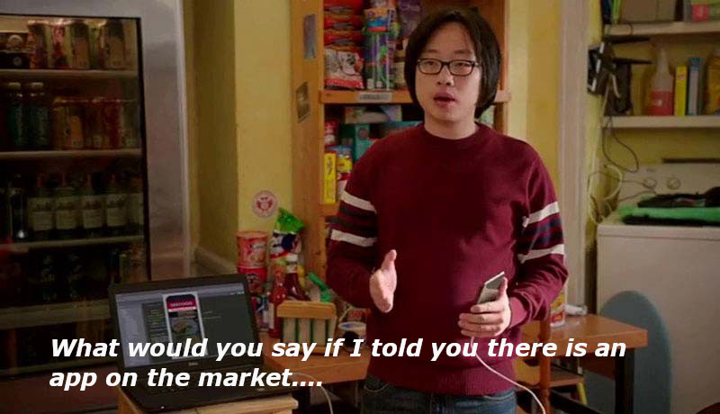

# Hi there!

We are an app aiming to solve the <b>issues</b> in education of the <b>sign language</b> for everyone. 

Through this writeup, we are trying to share the problems that we faced and the path that we took to tackle them. 

[Android app](https://play.google.com/store/apps/details?id=com.mangoai.leepi)

# How it all got started?

According to Census 2011 in India, around 7 million people are differently abled in Hearing and Speaking, of which about 15% are children. There are only few sign language school, and even then not everyone can afford to attend them.

Teachers interact with students through pictures on the wall. This creates a lot of friction from word to word, they also copy the expression, and signs as is, and don't understand the meaning behind it. Learning sign language requires a lot of patience and attention, which is not possible with the current infrastructure.

The use of oral communication with deaf-mute people is still prevalent. There is a huge gap between formal education and informal communication. Even parents use either oral expressions or an entirely different sign language while the kid is growing.

Use of oral expressions, and learning wrong sign language results in most of the people communicating with only single words. And even after completing their schooling and college, they are still unemployable. The one that gets employed, don't have access to good infrastructure to support them, in terms of communication, and education.

The consequence is that, millions of people from deaf-mute community are not able to complete their education, get a job, or even communicate properly.

# What are we doing?

We are making an app, Leepi( लिपि ) that helps people learn sign language. The users are presented with a sign through an avatar, they then have to perform the sign in the camera, and the app provides them with real-time feedback on the sign that they are practicing. The lessons of the app are pocket-sized, making it easier to consume

We have a working Android app, with four lessons teaching basic words, and letters.

The most important distinction that our app provides is the ability to practice the sign with the camera and get relevant feedback - we feel this is the most crucial thing while learning sign language. For now we have detection for signs and gestures, but we plan to add detection for facial expressions as well - our research tells us that it is crucial to communicate effectively in sign language.

# Features

* Interactive learning structure 
* Pocket size lessons for a fun experience 
* Gamification for motivation: badges and stars 
* Processing happens all in mobile, no data usage required 
* Protects your privacy as the data never leaves the device 

# Impact

Leepi( लिपि ) has been released as a part of winning Google Android Developer Challenge 2020. By the support from Google's technical and design teams, Leepi( लिपि ) has been made keeping privacy, scalability, reliability and user learning experience in picture.

Google has been promoting this application by showcasing it across the world. Various reviewers have received customized package and Android Developer magazine as a part of promotion. 

An online landing page is also made for the same. Here are the related articles to it -

[https://developer.android.com/helpful-innovation#leepi-section](https://developer.android.com/helpful-innovation#leepi-section)

[https://www.blog.google/products/android/developer-challenge-winners/](https://www.blog.google/products/android/developer-challenge-winners/)

[https://android-developers.googleblog.com/2020/06/dev-challenge-winners.html](https://android-developers.googleblog.com/2020/06/dev-challenge-winners.html)